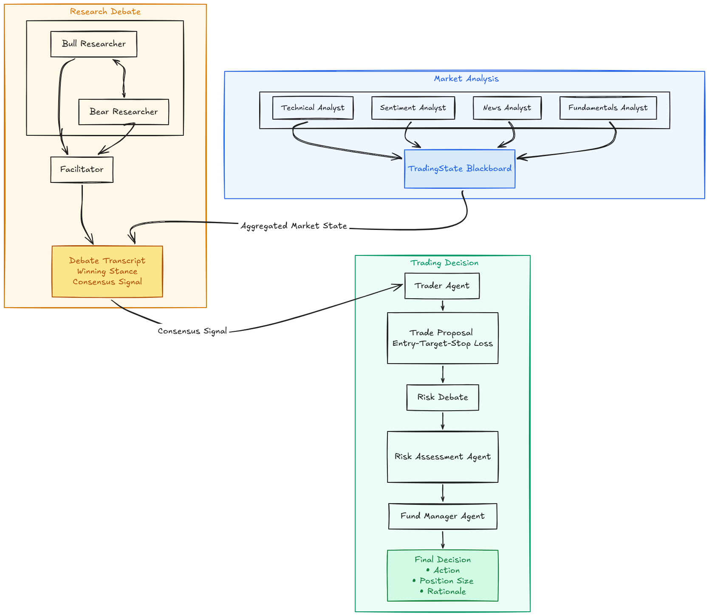
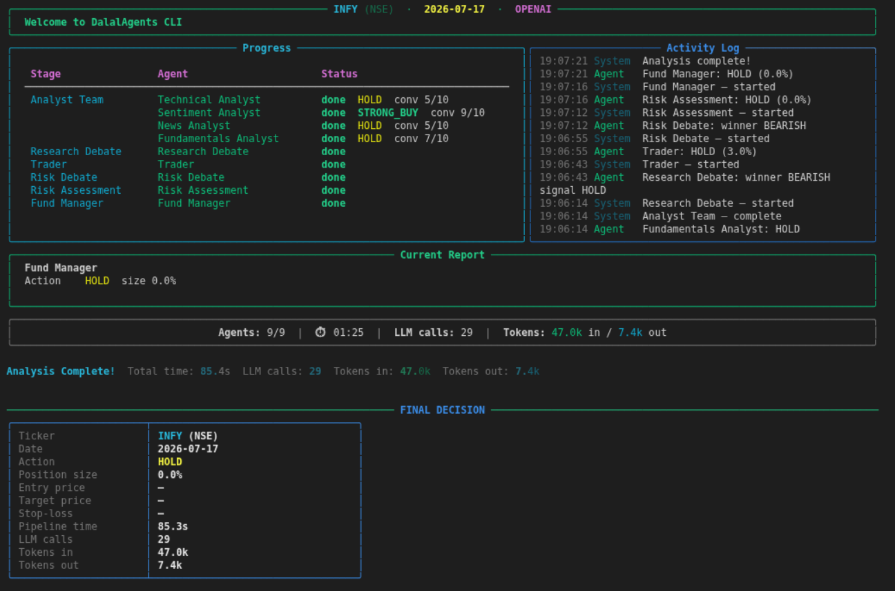

# DalalAgents

DalalAgents is a multi-agent LLM system that analyses Indian stock market tickers (NSE/BSE) and produces a reasoned trade decision for any given date. It runs a three-stage pipeline - analyst team, research debate, trading stage - each stage implemented as an autonomous LLM agent with tool access. All decisions are persisted in a local SQLite database, enabling historical replay and backtesting without repeating API calls.


## How it works


Every agent runs a **ReAct loop** (`dalal_agents/agents/base.py`): it can call tools (yfinance, screener.in, NewsAPI, Reddit), inspect results, then produce a Pydantic-typed JSON output. Stages share a single `TradingState` blackboard object, so each stage sees everything the earlier stages produced. Progress is checkpointed to SQLite after every stage, so a crash mid-run doesn't waste the LLM calls already spent.


## What makes it different from the TradingAgents paper repo

- **No LangGraph, no LangChain.** The pipeline and agent loop are implemented in plain `asyncio`. Every tool call, every message, every state transition is visible Python code.
- **Six LLM providers, pick any one.** Claude (Anthropic), OpenAI (GPT-4o), Gemini, OpenRouter, Grok (xAI), and Ollama (local, free) are all supported behind the same `BaseAgent` ReAct loop - see `dalal_agents/llm/`. Every provider client tracks its own call count and token usage.
- **Indian markets first.** Tickers resolve to `RELIANCE.NS` (NSE) or `RELIANCE.BO` (BSE) automatically. Market context uses `^NSEI` (Nifty 50) and `^INDIAVIX`. FII/DII flow data is fetched from NSE's own API.
- **Hard look-ahead bias guard.** Every data-fetching function in `dalal_agents/tools/` calls `_check_lookahead(as_of_date)` as its very first line. If the requested date is in the future, the function raises `ValueError` and refuses to proceed - you cannot accidentally train on tomorrow's prices.
- **SQLite persistence** Every pipeline run is stored in `dalal_agents.db`. Re-running the same ticker + date is a sub-second DB read. Backtests reuse cached decisions and never call the LLM twice for the same day.
- **Decision journal.** Every final decision is also appended to `dalal_memory.md` in plain English, and fed back into the FundManagerAgent's prompt on future runs for the same ticker.


## Installation

```bash
git clone https://github.com/SamarJyoti496/dalal-agents.git
cd dalal-agents

python -m venv venv
# Windows
venv\Scripts\activate
# macOS / Linux
source venv/bin/activate

pip install -r requirements.txt
```


## API keys

Copy `.env.example` to `.env` and fill in the keys for whichever provider(s) you plan to use:

```
ANTHROPIC_API_KEY=                     # required for --provider claude
OPENAI_API_KEY=                        # required for --provider openai (default)
GEMINI_API_KEY=                        # required for --provider gemini
OPENROUTER_API_KEY=                    # required for --provider openrouter
GROK_API_KEY=                          # required for the interactive TUI's Grok option
OLLAMA_BASE_URL=                       # optional - defaults to localhost:11434/v1
NEWSAPI_KEY=                           # optional – richer news for the News/Sentiment agents
REDDIT_CLIENT_ID=                      # optional – Reddit sentiment
REDDIT_SECRET=
REDDIT_USER_AGENT=DalalAgents/1.0 by u/yourhandle

# DEBUG, INFO, WARNING, or ERROR (default: INFO)
LOG_LEVEL=
```

You only need the key for the provider you actually use. OpenRouter gives access to Claude, Gemini, GPT-4o, Llama, and many others through a single key - get one at https://openrouter.ai/keys. Without the optional news/Reddit keys, those analyst agents return gracefully degraded reports.


## Usage

There are two front-ends over the same pipeline: a scriptable CLI (`dalal.py`) and an interactive Rich TUI (`cli/main.py`).

### Scriptable CLI

#### Analyse a single stock

```bash
python dalal.py run RELIANCE --date 2024-01-15 --provider openai
```

Flags: `--exchange NSE|BSE` (default NSE), `--provider claude|gemini|openai|openrouter` (default openai), `--model <override>`, `--no-cache` (force a fresh run, skipping both the cached-decision and checkpoint-resume shortcuts).

```
──────────────────────────────────────────────────────────────
FINAL DECISION - RELIANCE (NSE) 2024-01-15
──────────────────────────────────────────────────────────────
  Action:        BUY
  Position size: 7.0%  of portfolio
  Entry price:   ₹2,847.50
  Target price:  ₹3,050.00
  Stop-loss:     ₹2,740.00
  Decided at:    2024-01-15T14:32:11
  Pipeline time: 87s

  Rationale:
    Reliance Industries shows a strong technical breakout above the 200-day EMA.
    Fundamentals are robust with ROCE of 12.8% and zero promoter pledge.
    The research debate reached a clear bullish consensus with moderate key risks.
    Risk assessment sets position cap at 7% given India VIX at 14.2.
──────────────────────────────────────────────────────────────
```

#### Backtest over a quarter

```bash
python dalal.py backtest TCS --start 2024-01-01 --end 2024-03-31 --capital 1000000
```

```
Backtest: TCS (NSE)
  Period:       2024-01-01 → 2024-03-31  (61 trading days)
  Capital:      ₹10,00,000

BACKTEST RESULTS - TCS
──────────────────────────────────────────────────────────────
  Initial capital:     ₹  10,00,000
  Final value:         ₹  11,24,300
  Cumulative return:       +12.43%
  Sharpe ratio:              1.847
  Max drawdown:             -4.21%
  Trading days:                 61
──────────────────────────────────────────────────────────────
```

#### Review a stored decision in detail

```bash
python dalal.py show RELIANCE --date 2024-01-15
```

Shows the full final decision, all research debate turns (Bull vs Bear arguments + key points), and summaries from all four analyst agents - directly from the local SQLite cache, no API calls.

#### Browse your analysis history

```bash
python dalal.py history RELIANCE   # table of all RELIANCE decisions
python dalal.py list               # all tickers ever analysed
```

### Interactive TUI

```bash
python -m cli.main analyze
```

A `questionary` wizard (ticker, date, exchange, provider - Claude/Gemini/OpenAI/Grok/Ollama/OpenRouter - debate rounds, cache on/off) followed by a live-updating Rich dashboard: a per-agent progress table, a scrolling activity log, a current-report panel, and running LLM call/token stats, all driven by the pipeline's `progress_callback` events. At the end you can optionally print the full report and save the run's `TradingState` as JSON under `reports/`.



To exercise the TUI itself with zero API calls (useful when iterating on the display):

```bash
python -m cli.main mock --ticker RELIANCE
```

## Project structure

```
dalal-agents/
├── dalal.py                        ← thin entry point → cli/commands.py
├── cli/
│   ├── commands.py                 ← argparse CLI: run / show / history / list / backtest
│   ├── main.py                     ← Typer + Rich interactive TUI (questionary wizard + live dashboard)
│   └── mock.py                     ← fake pipeline (asyncio.sleep only) for TUI testing, no LLM/network
│
├── dalal_agents/
│   ├── config.py                   ← reads all env vars once; default model names & thresholds
│   ├── models.py                   ← every Pydantic model - the vocabulary all agents speak
│   ├── memory.py                   ← appends/reads dalal_memory.md (cross-run decision journal)
│   ├── logging_config.py           ← per-run debug log setup (logs/), driven by LOG_LEVEL
│   ├── agent.py                    ← backward-compat shim → llm/ + agents/
│   ├── analyst_team.py             ← backward-compat shim → agents/analysts
│   ├── debate.py                   ← backward-compat shim → agents/debate
│   ├── trading_stage.py            ← backward-compat shim → agents/trading
│   │
│   ├── llm/                        ← one async client class per model provider
│   │   ├── base.py                   LLMResponse - the provider-agnostic return type
│   │   ├── anthropic.py              AnthropicClient
│   │   ├── openai.py                 OpenAIClient
│   │   ├── openrouter.py             OpenRouterClient (subclasses OpenAIClient)
│   │   ├── grok.py                   GrokClient       (subclasses OpenAIClient)
│   │   ├── ollama.py                 OllamaClient     (subclasses OpenAIClient)
│   │   └── gemini.py                 GeminiClient
│   │
│   ├── agents/                     ← one class per "employee" in the simulated trading desk
│   │   ├── base.py                   BaseAgent - the shared ReAct loop
│   │   ├── analysts/                 Technical / Sentiment / News / Fundamentals + AnalystTeam runner
│   │   ├── debate/                   ResearchDebate (Bull vs Bear), RiskDebate (Risky/Neutral/Safe)
│   │   └── trading/                  TraderAgent, RiskAssessmentAgent, FundManagerAgent, run_trading_stage
│   │
│   ├── tools/                      ← pure data-fetching functions - no LLM calls in this package
│   │   ├── guards.py                 _check_lookahead and other shared helpers
│   │   ├── market.py                 yfinance OHLCV / Nifty / VIX / sector-index
│   │   ├── technicals.py             pandas-ta indicator computation
│   │   ├── fundamentals.py           screener.in scraping
│   │   └── sentiment.py              NewsAPI, Reddit, NSE options PCR, bulk/block deals
│   │
│   └── pipeline/                   ← SQLite persistence + orchestration
│       ├── db.py                     schema + init_db / persist_state / load_state / checkpoints
│       ├── run.py                    run_pipeline - Stage I/II/III orchestration
│       ├── calendar.py               get_nse_trading_days - real NSE trading calendar
│       └── backtest.py               run_backtest - historical simulation
│
├── ARCHITECTURE.md                 ← full technical deep-dive
├── requirements.txt
├── .env.example                    ← copy to .env and fill in your keys
├── dalal_agents.db                 ← created on first run (git-ignored)
├── dalal_memory.md                 ← decision journal (created on first run)
├── logs/                           ← per-run debug logs (git-ignored)
└── reports/                        ← JSON exports from the interactive TUI (git-ignored)
```


## Disclaimer

DalalAgents is a research and educational project. Nothing it produces constitutes financial advice, investment recommendations, or a solicitation to buy or sell any security. Past backtest performance does not guarantee future results. Use it to learn about multi-agent LLM systems - not to make real trading decisions.
